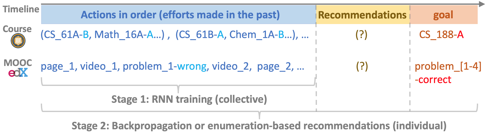

# Time Slice Inputation for Goal-based Recommendation

## Introduction:

This repo includes code for the paper:

* [Weijie Jiang](https://jennywjjiang.com/) and [Zachary A. Pardos](https://gse.berkeley.edu/zachary-pardos), 2019. [Time Slice Imputation for Personalized Goal-based Recommendation in Higher Education.](https://dl.acm.org/doi/10.1145/3298689.3347030) *In Proceedings of the Thirteenth ACM Conference on Recommender Systems (RecSys'19)*. ACM, pp 506-510,

which extended the RNN-based goal-based course recommendation algorithm in Section 7 of the following paper: 

* [Weijie Jiang](https://www.jennywjjiang.com), [Zachary A. Pardos](https://gse.berkeley.edu/zachary-pardos), Qiang Wei, 2019. [Goal-based Course Recommendation.](https://dl.acm.org/doi/10.1145/3303772.3303814) *In Proceedings of the 9th International Conference on Learning Analytics and Knowledge (LAK'19)*. ACM, Pages 36-45,

by enhancing the learning process the personalized prerequisite courses for any target course, and also applying the goal-based recommendation framework to the MOOCs context, as illustrated here:

<center>

</center>

## Dataset:

Due to FERPA privacy protection, we cannot publish the original student enrollment dataset and the MOOCs dataset. However, we provide code to run the proposed method on [a synthetic student enrollment dataset](https://github.com/fabulosa/goal-based-recommendation/tree/master/synthetic_data_samples) that we published in this [repo](https://github.com/fabulosa/goal-based-recommendation) with data descriptions.

## Steps for Running the Code:

### Environment Prerequisites:
* python3
* pytorch
* install other dependencies by: *pip3 install -r requirements.txt*

### Data Preprocessing:

**-- command:**

* Download dataset from [here](https://github.com/fabulosa/goal-based-recommendation/tree/master/synthetic_data_samples) to a local directory **/synthetic\_data\_samples*
* Set up global parameters in _data\_preprocess/utils.py_
* `python data_preprocess/preprocess.py`
	
This command hard codes the locations of the expected data files to be in the synthetic data folder. This path can be changed in utils.py.

Then the following intermediate files will be generated for model training:
	
* **course dictionaries (_course\_id.pkl_)**: a pair of python dictionaries mapping courses to their preprocessed ID and vice versa.
* **grade dictionary (_grade\_id.pkl_)**: a pair of python dictionaries mapping all types of grades to their preprocessed ID and vice versa. 
* **semester dictionary (_semester\_id.pkl_)**: a pair of python dictionaries mapping semesters to their preprocessed ID vice versa. For example, the earliest semester in the dataset, 2014 Fall, will be set 0 as its ID. 
* **condensed student enrollments and grades (_stu\_sem\_grade\_condense.pkl_)**: a 2D python list with dimention `n×m`, where `n` is the number of students and `m` is the number of semesters covered in the dataset: 
, where , and  denotes the preprocessed enrollment histories of the i-th student in your data (multiple semesters) and  represents the specific enrollment histories of the i-th student in the k-th semester. Note that the k-th semester of all the students refers to the same semester, for example, m=3, which means there are 3 semesters covered in your data: Fall 2019, Spring 2020, Summer 2020, then  will contain enrollment histories of Spring 2020 for all students in your data. The format of  is a python list: , where  refers to the course ID of the p-th course the i-th student enrolled and the grade ID received for that course in the k-th semester.  (empty) if the i-th student did not enroll in any course in semester k.

### Student Grade Prediction:

We selected the RNN-based grade prediction model without taking student major as the input (Model 2) in paper [Goal-based Course Recommendation](https://dl.acm.org/doi/10.1145/3303772.3303814) as the base model to surface personalized prerequisite courses in this work because it demonstrated the best grade prediction performance.
 
**-- command**

* `cd grade_prediction`
*  Set up arguments and hyperparameters for training in _grade\_prediction/utils.py_ (optional)
*  training: `python train.py`
	*  The best model(.pkl) and the log file that records the training loss and validation loss will be saved in [_grade\_prediction/models_](https://github.com/fabulosa/new_goal_based_recommendation/tree/master/grade_prediction/models). 
*  Set up _evaluated\_model\_path_ and _evaluated\_semester_ in _grade\_prediction/utils.py_, which corresponds to the model and semester you aim to evaluate (optional).
*  evaluation: `python evaluate.py`. 
	* Evaluation results will be printed out based on these metrics: 

		* grade prediction accuracy on enrollments with letter grades
		* grade prediction accuracy on enrollments with non-letter grades
		* overall grade prediction accuracy
		* true positive rate, true negative rate, false negative rate, and false positive rate on letter grade prediction and non-letter grade prediction
		* F-score on letter grade prediction and non-letter grade prediction, overall F-score

### New Goal-based Course Recommendation:

**-- command**

* `cd student_evaluation`
* Set up arguments in _goal\_based\_new/utils.py_ (optional)
* Generate filters: `python generate_filters.py`
	* Filter files (.pkl) will be saved in the current directory.
* Learn to generate goal-based recommendations: `python train.py --target_course xxx`, where `xxx `is the name of a course (e.g., Subject_33 101) that you intend to set as a goal(target) course.
	* This will print out (1) the number of well-performing students and under-performing students in this course in the evaluated semester, (2) the recommendation accuracy for the two groups of students.
	* This will also save the enrollment histories and the recommended courses in the evaluated semester of these students to a csv file in [*goal\_based\_new/results*](https://github.com/fabulosa/new_goal_based_recommendation/tree/master/goal_based_new/results).

## Contact and Citation
Please do not hesitate to contact us (jiangwj[at]berkeley[dot]edu, pardos[at]berkeley[dot]edu) if you have any questions or encounter any problems in running the code. We appreciate your support and citation if you find this work useful.

```
@inproceedings{jiang2019time,
  title={Time slice imputation for personalized goal-based recommendation in higher education},
  author={Jiang, Weijie and Pardos, Zachary A},
  booktitle={Proceedings of the 13th ACM Conference on Recommender Systems},
  pages={506--510},
  year={2019}
}
```
